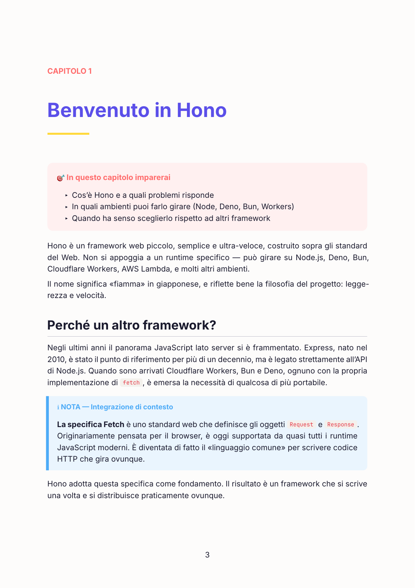
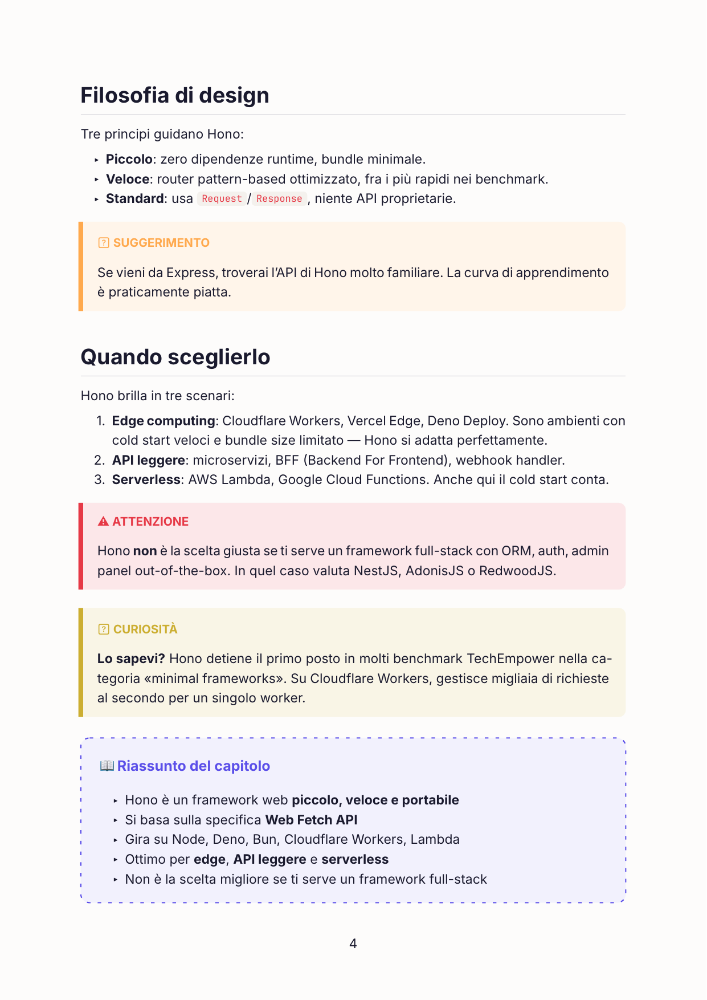

<div align="center">


# docs-to-book

### Turn any technical documentation URL into a beautiful, colorful PDF book — in any language, in any tone.

[](https://docs.claude.com/en/docs/claude-code)
[](https://typst.app/)
[](LICENSE)
[]()

<sub>Crawl → Outline → Approve → Generate (in parallel) → 📖 PDF</sub>

</div>

---

> **From this 👇**
>
> ```
> https://hono.dev/docs
> ```
>
> **To this 👇**
>
> A polished, multi-chapter PDF book with cover, table of contents, callouts, syntax-highlighted code, and zero hallucinations — generated in minutes by parallel sub-agents.

<br />

## ✨ Demo

<div align="center">

<table>
  <tr>
    <td align="center" width="33%">
      
      <br /><sub><b>📕 Custom cover</b><br />Bold, colorful, automatic</sub>
    </td>
    <td align="center" width="33%">
      
      <br /><sub><b>🎯 Chapter openers</b><br />"What you'll learn" boxes + clean typography</sub>
    </td>
    <td align="center" width="33%">
      
      <br /><sub><b>🎨 Smart callouts</b><br />Notes · Warnings · Examples · Tips · Trivia · Recap</sub>
    </td>
  </tr>
</table>

</div>

<br />

## 🚀 Why this exists

Reading technical docs in a browser is fine. But sometimes you want to:

- 📚 **Study offline** — on a plane, in the park, on a Kindle
- 🌍 **Translate** the whole thing into your native language
- 🎓 **Onboard juniors** with a friendlier, narrative version
- 🖨 **Print it** as a physical book for your team library
- 🧠 **Annotate** with the joy of an actual PDF reader

`docs-to-book` does it for you. Hand it a URL. Get back a book.

<br />

## 🎬 How it works

```
   ┌──────────────┐    ┌─────────────┐    ┌──────────────┐    ┌──────────────┐
   │   📥 Input   │ ─▶ │  🕸 Crawl   │ ─▶ │  📑 Outline  │ ─▶ │  ✅ Approve  │
   │  URL · Lang  │    │  Recursive  │    │  Chapters +  │    │   Edit /     │
   │   · Tone     │    │  · Same     │    │  scope from  │    │   Exclude /  │
   │              │    │   domain    │    │  doc map     │    │   Reorder    │
   └──────────────┘    └─────────────┘    └──────────────┘    └──────┬───────┘
                                                                      │
                          ┌───────────────────────────────────────────┘
                          ▼
            ┌─────────────────────────────┐    ┌──────────────────┐
            │  ⚡ Parallel sub-agents     │    │  🖨 Compile      │
            │  ─────────────────────      │ ─▶ │   Typst → PDF    │ ─▶ 📖 book.pdf
            │   chapter 1 → ./cap-01.typ  │    │   Cover + TOC +  │
            │   chapter 2 → ./cap-02.typ  │    │   styled chapters│
            │   chapter N → ./cap-NN.typ  │    │                  │
            └─────────────────────────────┘    └──────────────────┘
```

Each chapter is generated by an independent sub-agent that sees only its own scope. A 20-chapter book takes ~3 minutes instead of ~20.

<br />

## 🌟 Features

<table>
  <tr>
    <td>🌐 <b>Recursive crawling</b><br /><sub>Same-domain, path-prefixed, polite (User-Agent + delay)</sub></td>
    <td>🤖 <b>Parallel sub-agents</b><br /><sub>One per chapter, ~5–10× faster than sequential</sub></td>
    <td>🎨 <b>Beautiful Typst PDFs</b><br /><sub>Colorful cover, TOC, callouts, syntax-highlighted code</sub></td>
  </tr>
  <tr>
    <td>🌍 <b>Multi-language</b><br /><sub>Italian, English, Spanish, German, French… (anything Claude speaks)</sub></td>
    <td>🎭 <b>3 tones</b><br /><sub><code>technical</code> · <code>balanced</code> · <code>warm</code></sub></td>
    <td>✏️ <b>Editable outline</b><br /><sub>Confirm, edit, exclude or reorder chapters before generation</sub></td>
  </tr>
  <tr>
    <td>🔒 <b>Anti-hallucination</b><br /><sub>Strict integrity rules + dedicated <code>#nota</code> callouts for added context</sub></td>
    <td>📦 <b>Pure CLI tooling</b><br /><sub>Python + Typst + jq — no SaaS, no accounts</sub></td>
    <td>🧩 <b>Drop-in skill</b><br /><sub>One symlink in <code>~/.claude/skills/</code> and you're set</sub></td>
  </tr>
</table>

<br />

## 🚀 Quick Start

### Prerequisites

| Tool | Why | Install |
|------|-----|---------|
| **Claude Code** | Runs the skill | [docs.claude.com](https://docs.claude.com/en/docs/claude-code) |
| **Typst** ≥ 0.13 | Compiles the PDF | `brew install typst` |
| **jq** | Reads outline JSON | `brew install jq` |
| **Python** ≥ 3.9 | Crawler & extractor | Pre-installed on macOS |

### Install

```bash
# 1. Clone the repo
git clone git@github.com:EliaTolin/docs-to-book-skills.git
cd docs-to-book-skills

# 2. Install Python deps
pip install --user requests beautifulsoup4 markdownify readability-lxml lxml

# 3. Symlink the skill into Claude Code
mkdir -p ~/.claude/skills
ln -s "$(pwd)/docs-to-book" ~/.claude/skills/docs-to-book
```

### Use it

In Claude Code, just say it:

```
Trasforma la doc di Hono in un libro PDF in italiano, tono caloroso.
```

or

```
Build me a PDF book from https://hono.dev/docs in English, technical tone.
```

The skill will trigger automatically. It'll ask for any missing parameter, propose an outline, let you edit/exclude chapters, then generate the book.

📖 **Output:** `~/Desktop/docs-to-book-output/<book-title>.pdf`

<br />

## 🎭 Tones at a glance

| Tone | Best for | Example sentence |
|------|----------|------------------|
| `technical` | Senior devs, reference material | *"The middleware pipeline executes in registration order; mutations to `c.req` before the handler are visible downstream."* |
| `balanced` | General developer audience (default) | *"Hono's router compiles routes once at boot, so even with hundreds of routes lookup stays fast."* |
| `warm` | Beginners, learners from other backgrounds | *"Picture a hotel concierge who instantly knows where to send each guest — that's how Hono routes requests, in milliseconds."* |

<br />

## 🔒 The integrity contract

A book that invents APIs is worse than no book. `docs-to-book` enforces:

- ✅ **Verbatim** code examples from the source documentation
- ✅ **Explicit** uncertainty when the doc is ambiguous (no plausible-sounding fillers)
- ✅ **Marked integrations** — general knowledge (e.g., "what is REST") is allowed, but always inside a `#nota[...]` callout, visually distinct from the documentation content
- ❌ **No invented** functions, parameters, flags, version numbers, rate limits, comparisons, or quotes

See [`docs-to-book/references/integrity_rules.md`](docs-to-book/references/integrity_rules.md) for the full contract.

<br />

## 🧱 Architecture

```
docs-to-book-skills/
├── 📕 logo.png
├── 📄 README.md
├── 📁 docs/preview/                       # README screenshots
│   ├── cover.png
│   ├── chapter-open.png
│   └── callouts.png
└── 📁 docs-to-book/                       # The skill itself
    ├── 📜 SKILL.md                        # Claude reads this first
    ├── 📁 scripts/
    │   ├── crawl.py                       # Recursive crawler (requests + bs4)
    │   ├── extract.py                     # HTML → clean Markdown
    │   └── compile_book.sh                # Assemble + compile via Typst
    ├── 📁 assets/
    │   ├── styles.typ                     # Palette, callouts, typography
    │   └── cover.typ                      # Cover + TOC templates
    ├── 📁 references/                     # Loaded on demand
    │   ├── tone_guide.md                  # 3 tones, side by side
    │   ├── integrity_rules.md             # Anti-hallucination rules
    │   ├── crawling_strategy.md           # SPA, sitemap.xml, llms.txt fallbacks
    │   └── typst_callouts.md              # Quick reference for sub-agents
    └── 📁 evals/
        └── evals.json                     # Test cases
```

<br />

## 🎨 Available callouts

When sub-agents write chapters, they can reach for these visual blocks (all defined in `assets/styles.typ`):

| Callout | Purpose | Color |
|---------|---------|-------|
| `#cosa-imparerai` | Chapter opener with learning goals | 🔴 Coral |
| `#nota` | Added general knowledge (not from docs) | 🔵 Blue |
| `#attenzione` | Warning, gotcha, breaking change | 🔴 Red |
| `#esempio` | Practical example | 🟢 Green |
| `#suggerimento` | Best practice from docs | 🟠 Orange |
| `#curiosita` | Trivia, history (warm tone only) | 🟡 Yellow |
| `#riassunto` | Chapter recap | 🟣 Indigo |

<br />

## 🛣 Roadmap

- [ ] **SPA support** — auto-fallback to Playwright when initial crawl returns empty pages
- [ ] **GitHub repo source** — point to a `/docs` folder on GitHub instead of a URL
- [ ] **EPUB output** — for Kindle / e-readers
- [ ] **Diagram generation** — turn complex concepts into Mermaid/Graphviz figures
- [ ] **Custom themes** — multiple palettes (dark, pastel, retro, corporate)
- [ ] **Resume on failure** — recompile only failed chapters
- [ ] **Cover image** — fetch product logo automatically

Got an idea? [Open an issue](https://github.com/EliaTolin/docs-to-book-skills/issues).

<br />

## 🤝 Contributing

PRs are welcome! Some easy wins:

- New tone presets (e.g., `academic`, `journalistic`, `socratic`)
- Better SPA crawling strategies
- Localization of the default callout labels
- Theme variants in `assets/styles.typ`

Please run the included evals (`docs-to-book/evals/evals.json`) before submitting and include a sample PDF if your change affects rendering.

<br />

## 📄 License

[MIT](LICENSE) © Elia Tolin

<br />

<div align="center">

### Made with ❤️ and [Claude Code](https://docs.claude.com/en/docs/claude-code)

<sub>If <code>docs-to-book</code> saved you an afternoon, a ⭐ on GitHub costs nothing.</sub>

</div>
